# Final Project: Measuring Galaxy Redshift

### 1\. Introduction

A core pillar of much astronomical research depends on redshift, or more specifically the relativistic doppler effect of light. In this project a galaxy’s redshift will be computed from spectral data provided by the Sloan Digital Sky Survey (SDSS).

All bodies in the universe radiate a black body spectrum dependent on their temperature. When observing the black body spectra of stellar objects, the existence of dips and peaks in the relative flux of the curve is apparent. These are absorption and emission lines respectively. Both are caused by the quantum nature of energy in matter. Depending on the electron configuration of an atom, a specific wavelength(s) of light can be absorbed or emitted. This is atom-specific and effectively can be used to decode what the elemental composition of an object is from its spectra.

Similar to how the doppler effect works with sound, relativity makes it apparent that light must behave the same way. When a light emitting object is moving toward an observer the wavelength of the incoming light is compressed or is blueshifted. Oppositely, an object moving away has its light’s wavelength stretched or redshifted. Absorption and emission lines, or more generally spectral lines, are fixed at exact wavelengths. As such, any changes in the wavelength of a spectra would be immediately apparent by a translation discrepancy across each spectral line compared to the known value for each emission. In astronomical analysis spectral lines commonly include the hydrogen Balmer Series (H-Alpha, H-Beta…) as most of the universe is composed of hydrogen. For this project the SDSS website collection was consulted and the following spectral lines were determined to possibly be of interest:

| Emission lines (Angstrom) | Absorption lines(Angstrom) |
| :---- | :---- |
| Sulphur II: 6732.67, 6718.29 | Calcium II: 8664.52, 8544.44, 8500.36 |
| Hydrogen Alpha: 6564.61 | Sodium: 5895.6 |
| Nitrogen II: 6585.27, 6549.86 | Magnesium: 5176.7  |
| Oxygen III: 5008.240, 4960.295 | G-Band: 4305.61 |
| Hydrogen Beta: 4862.68 | H-Band: 3969.588 |
|  | K-Band: 3934.777 |

The G-Band, H-Band and K-Band refer to Fraunhofer lines which are composed of several elements.

The object of interest to this project is the galaxy pictured in (Fig. 1), which spectral data from the SDSS data release 12 was provided. Analysis was done on only this single spectra. The data is in a FITS file format containing multiple columns but for this analysis only flux and wavelengths are needed.

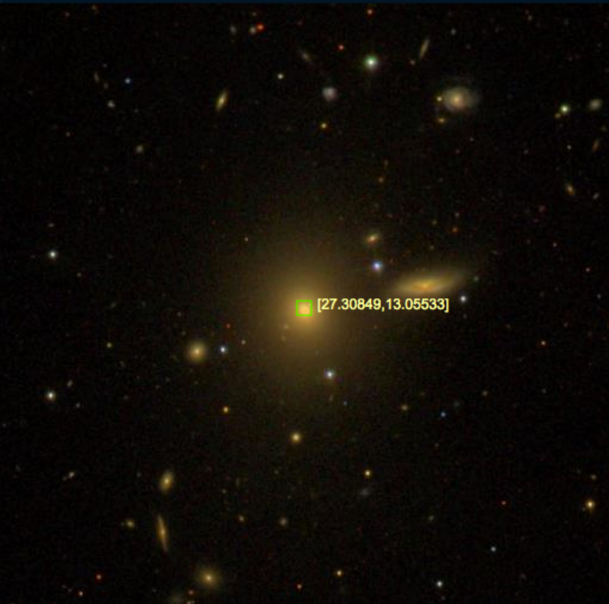
***Fig. 1** SDSS galaxy 0429-51817-01. RA and Dec coordinates are labeled in yellow.*

### 

### 2\. Measuring the Redshift

Using the *astropy.io* library the provided SDSS fits file was loaded into python and extracted for wavelength and flux data. These based on the header file are in units of Angstrom and 1E-17 erg/cm^2/s/Angstrom respectively. The following figure was produced with this data (Fig 2).

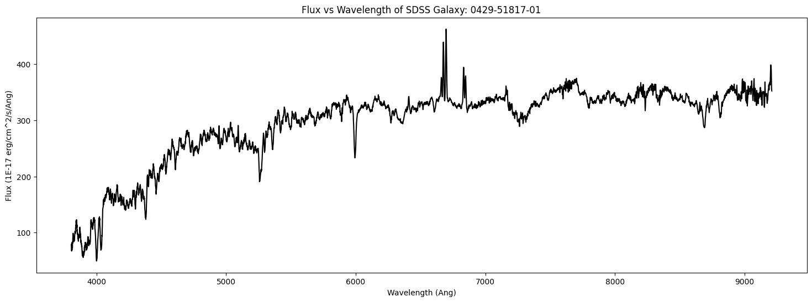
***Fig 2\.** Flux vs Wavelength of SDSS Galaxy: 0429-51817-01*

#### 

#### 2.1 Identifying Areas of Interest

From the emission and absorption table in (Sec. 1), these specific wavelengths were marked by dashed vertical lines at the correct locations across the flux data producing (Fig. 3). Emissions were grouped on the left and absorptions on the right. Each feature has a unique color and label.

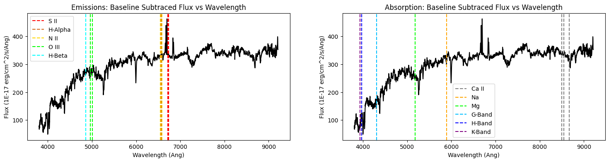
***Fig 3\.*** Emission and absorption wavelengths of interest across the flux data. These wavelengths are not redshifted. 

#### 2.2. Evaluating Emission / Absorption Line Prominence

From the result in (Sec. 2.1), the flux was sliced around emission and absorption lines. This yields a much better understanding of how the flux is shifted overall and what lines likely match up to what features on the flux data. The following figure (Fig. 4\) is the result of this. O III and H-Beta emission is the top left, S II, H-Alpha and N II emission is top right. Na, Mg, G-Band, H-Band and K-band absorption, bottom left. Ca II absorption bottom right.

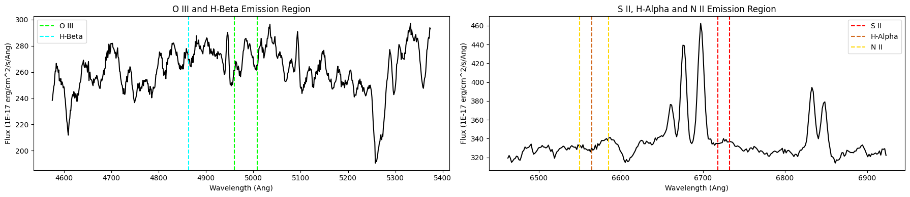
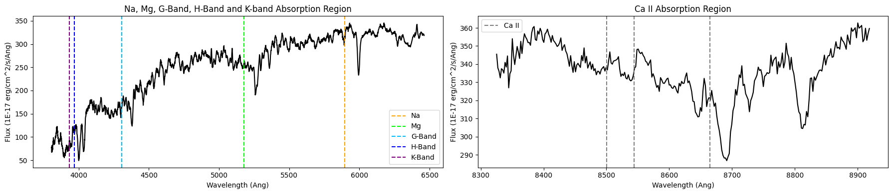
**Fig 4\.** *Flux around emissions and absorptions. Matching features are now clearly visible.*  
For better determination of the spectral peaks and troughs: a smoothed flux was then computed using a gaussian filter with a two sigma parameter and (Fig. 4\) was recreated to verify that the smoothing operation did not discard spectral features. This is displayed in (Fig. 5).

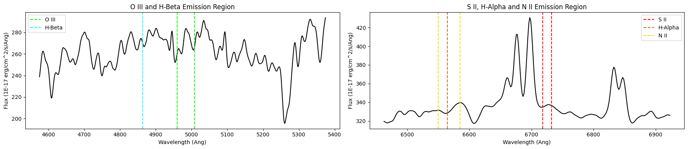
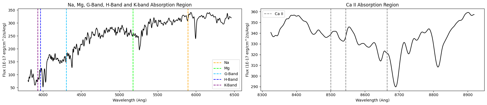
**Fig 5\.** *Smoothed flux around emissions and absorptions.* 

#### 2.3. Determine Redshift Values

At this point it is visually obvious that the flux is shifted to the right of these spectral lines. Or rather it is redshifted, which is what we should expect. From here the usefulness of the data matching each spectral line was qualitatively ranked.

1\. SII, H-Alpha, N II Emission  
2\. Na, Mg, G-Band, H-Band and K-band Absorption  
3\. Ca II Absorption  
~~4\. O III and H-Beta Emission Region~~

O III and H-Beta were thrown out because the spectral features in this area were not prominent enough to accurately determine the matching peaks. 

In the order of the ranking the following process took place:

* Slice in on spectral line and identified matching feature  
* Compute the maximums or minimums depending on emission or absorption  
* Save the correct extrema as ‘shift\_\[spectral line\]’

This produced the following series of graphs (Fig 6).

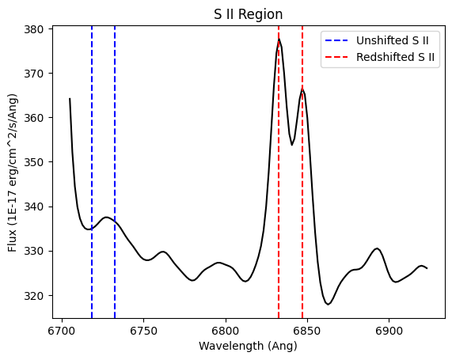
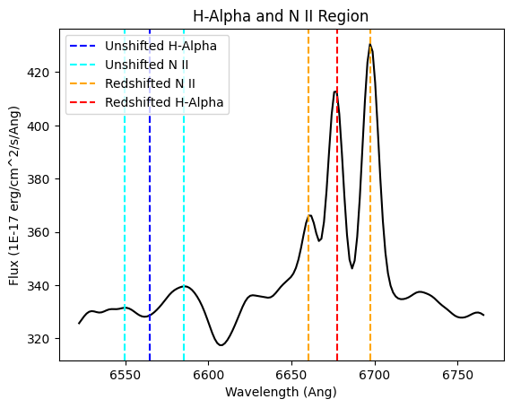
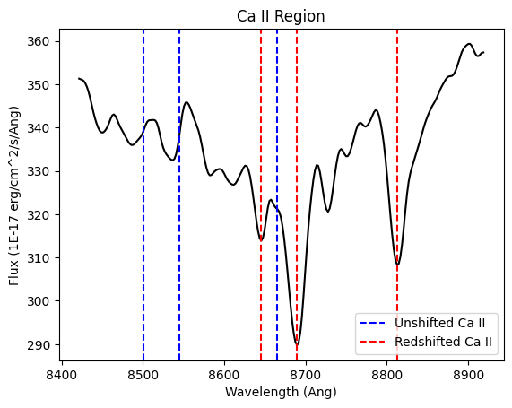
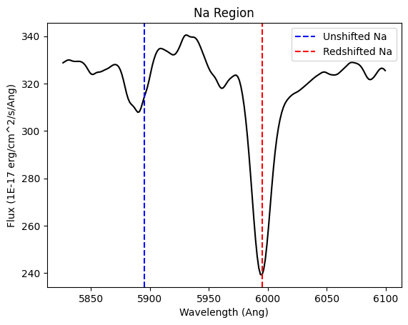
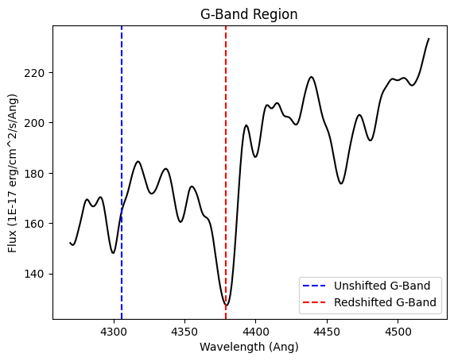
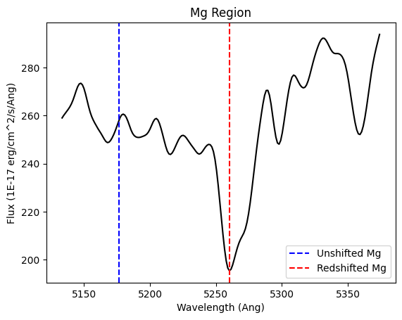
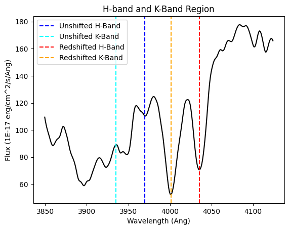
**Fig. 6** *Red Shifted wavelengths found*
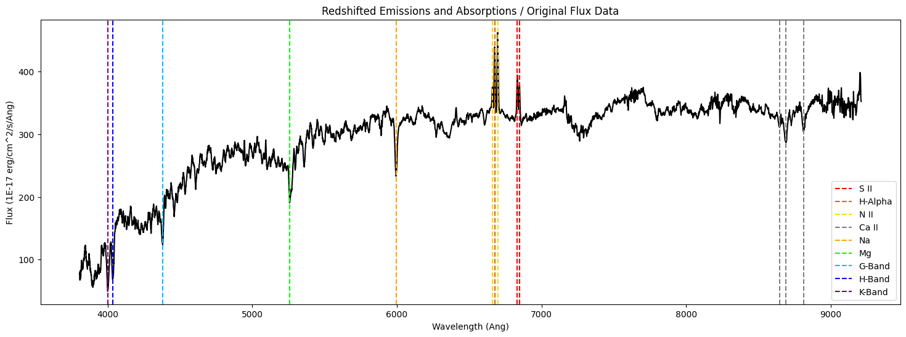
**Fig. 7** *Compiled red shifted spectral lines overlaid on original flux.*

Compiling these results created the above (Fig. 7). The O III and H-Beta bands as discussed earlier were discarded.

#### 2.4. Redshift Evaluation and Compilation

Next, redshift values (z \= Δλ / λ) can be computed by subtracting the observed and rest wavelengths divided by the rest wavelength. This was done for each spectral line:

	S II z values: 0.016980578122238268, 0.017047466575386003  
H-Alpha z value: 0.017164177736758213  
N II z values: 0.01701299654854692, 0.016875787111289453  
Na z value: 0.016885540169787574  
Mg z value: 0.016124628292396737  
G-Band z value: 0.017104061438158666  
H-Band z value: 0.01661057683678377  
K-Band z value: 0.016903890376125497  
Ca II z values: 0.017081099847423696, 0.016989122641448647, 0.017097777697062173

Computing the mean of this set of data yields: **z \= 1.6914E-02**

### 

### 3\. Evaluating the Uncertainty

The standard deviation of the previously computed mean was found to be 2.7623E-04.  
Visually this was compiled into (Fig. 8). A box plot shows a single standard deviation and average value while a scatter plot marks each respective spectral line’s computed z value.

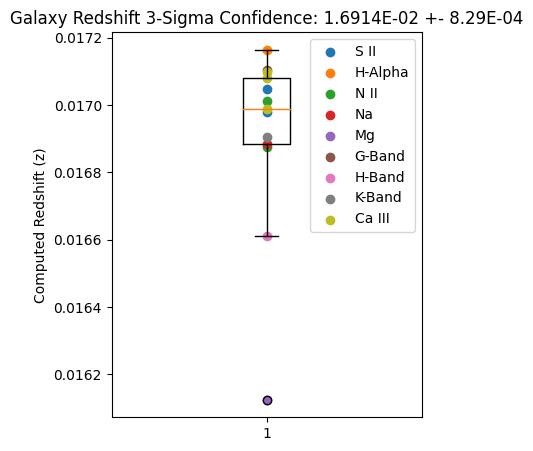
**Fig 8\.** *Box plot of mean redshift value. Each spectral line z value is scatter plotted.*

#### 3.1 How the Uncertainty Scales

The number of spectral lines used was rather arbitrary. A large group were tested for and most were successfully processed. Does the amount of spectral lines significantly change the uncertainty (Fig. 9). Yes it does. This result appears to indicate that past six lines a trend starts to form where the standard deviation is inversely proportional to line count. Six lines could indicate a threshold of statistical significance however more points would be needed to see if the trend past this point continues.

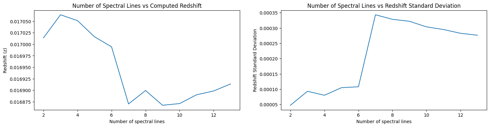

**Fig 9\.** *Uncertainty and z-value with number of lines. Bottom plots are zoomed versions of top.*

#### 3.2. Systematic Differences Between Different Lines

Two different types of spectral lines were used: emission and absorption. Do these have any systematic difference in measurement? The absorption z-values and emission z-values were separated into respective arrays and analyzed:

Mean absorption z value: 1.6850E-02 \+- 1.01E-03  
Absorption z value standard deviation: 3.3517E-04

Mean emission z value: 1.7016E-02 \+- 3.14E-04  
Absorption z value standard deviation: 1.0473E-04

Creating a graphic of this analysis the following was made (Fig. 10). The left box plot is absorption originating z-values and the right box plot is emission originating z-values.

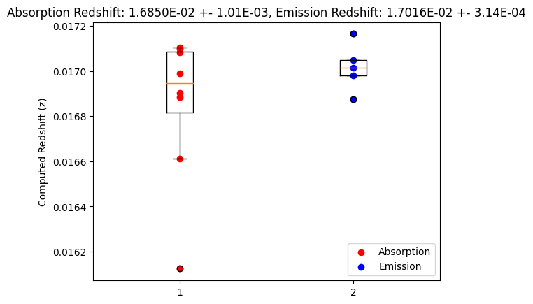
**Fig 10\.** *Absorption v Emission Redshift computation.*

Although the spread of the emission z-values is narrower, the average values are largely the same and the error bars of each overlap the other. If there was a significant difference between the two groups it would be expected that these plots would be largely separated on the z axis.  
In other words, absorption or emission does not differently compute redshift.

#### 

#### 3.3. Significant Trends With Wavelength

Another interesting point to look into would be whether wavelength gives any trend to the z-value. For this the wavelengths and corresponding resulting z-values were arranged into matching sorted arrays of descending wavelength. A linear and a cubic fit were computed using np.polyfit and the resulting figure produced. (Fig. 11).  
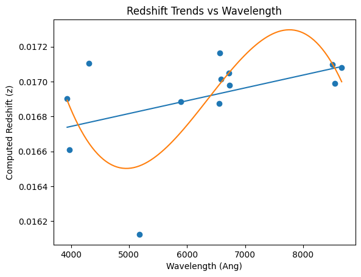 
**Fig 11\.** *Redshift value trends with wavelength. A linear and cubic fit were computed.*

Visually both of these fits do not match the raw data very well. This conclusion can be further supported by computing the chi^2 and p-value for each fit:

Linear: chi^2: 4.397e-05, p-val: 1.0  
Cubic: chi^2: 3.108e-05, p-val: 1.0

As such p-values of 1.0 indicate there is no correlation between wavelength and redshift. 

### 4\. Conclusion

Using a series of common spectral emission and absorption lines, a total of thirteen successful matches to the galaxy flux were found (Fig. 7\) and resulted in an equal amount of redshift computations. The mean value of these computations was found to be **1.6914E-02 \+- 8.29E-04**. Where the uncertainty is a 3-sigma or 99.7% confidence. This uncertainty decreases with increasing spectral lines according to (Fig. 9), which is cohesive with frequentist statistical logic. There is no correlation between the emission or absorption lines and the resulting redshift value (Fig. 10). The wavelength of the measured spectral line does not correlate to the resulting redshift value (Fig. 11). Both of these conclusions are consistent with a galaxy moving away from our observation point at Earth. If the emission and absorption lines yielded different results there likely would not be a single motion. Similarly, a trend in wavelength would indicate some kind of motion difference across the temperature of the galaxy. As neither are the case this appears to be a fairly standard observation. This is not an extreme redshift. Such a small value would indicate that this object is fairly close (or rather the observed light is recent). Future analysis could include nearby galaxies and a comparison of their individual redshifts or multiple separate datasets of this object to potentially look for any trends in the redshift over time.

#### References

SDSS common spectral lines table

[https://classic.sdss.org/dr6/algorithms/linestable.php](https://classic.sdss.org/dr6/algorithms/linestable.php)

SDSS data release 12

[http://www.sdss.org/dr12/spectro/](http://www.sdss.org/dr12/spectro/)
